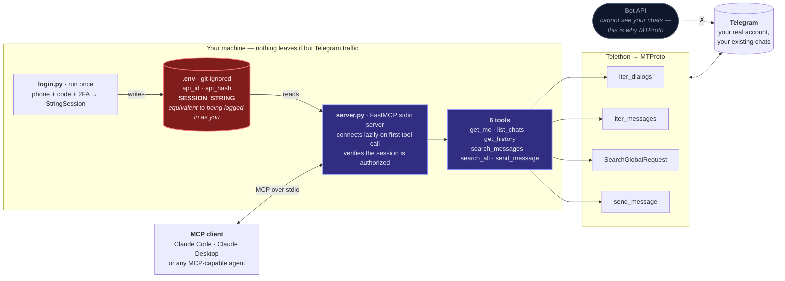

# Telegram MCP Server

A local [Model Context Protocol](https://modelcontextprotocol.io) server that gives an AI agent (Claude Code, Claude Desktop, or any MCP client) controlled access to **your own Telegram account**: list chats, read history, search, and send messages, through Telegram's MTProto API.

Built with Python + [Telethon](https://docs.telethon.dev). Runs entirely on your machine; your login session never leaves it.

  

## Why

Telegram's **Bot API can't see your existing chats**; a bot is a separate identity and only receives messages explicitly sent to it. To let an agent work with *your* real conversations you need the **MTProto client API**, authenticated as your user account. This project wraps that in a small, focused MCP server so any MCP-capable agent can read and act on your Telegram; without you writing glue code each time.

## How it fits together

A Telegram **bot** is a separate identity and only sees messages sent to it. To let an agent
work with *your* conversations, the server authenticates as your user account over MTProto,
which is why the session string matters as much as it does.



Results come back as plain JSON-serializable dicts, so the agent summarizes from structured
data rather than scraped text.

## Features

- **6 tools** covering the common read/write actions (see below)
- **Local-only** — credentials and session live in a git-ignored `.env`; nothing is sent anywhere except Telegram
- **Standard MCP stdio server** — works with Claude Code, Claude Desktop, or any MCP client
- **One-time login** — interactive script stores a reusable session string; no re-auth on every run
- **Small and readable** — under 300 lines of Python, easy to audit and extend

## Tools

| Tool | Description |
|------|-------------|
| `get_me()` | Return the connected account (sanity check) |
| `list_chats(limit=20)` | Your most recent conversations |
| `get_history(chat, limit=30)` | Recent messages from one chat |
| `search_messages(chat, query, limit=30)` | Search within one chat |
| `search_all(query, limit=30)` | Search across **all** your chats at once |
| `send_message(chat, text)` | Send a message as you |

`chat` accepts a username (`@name`), numeric id, phone number, `t.me` link, or the chat's display name.

## Quickstart

### 1. Install

```bash
git clone https://github.com/Shaan-alpha/telegram-mcp.git
cd telegram-mcp
python -m venv .venv

# Windows
.venv\Scripts\pip install -r requirements.txt
# macOS / Linux
.venv/bin/pip install -r requirements.txt
```

### 2. Get API credentials

Go to [my.telegram.org](https://my.telegram.org) → **API development tools** → create an app → copy the `api_id` and `api_hash`.

### 3. Log in (one time)

```bash
# Windows
.venv\Scripts\python login.py
# macOS / Linux
.venv/bin/python login.py
```

Enter your `api_id`/`api_hash`, phone number (with country code), and the login code Telegram sends you (plus your 2FA password if set). This writes a reusable session to `.env`.

### 4. Register with your MCP client

**Claude Code:**

```bash
claude mcp add telegram --scope user -- "/abs/path/.venv/bin/python" "/abs/path/server.py"
```

**Claude Desktop**; add to `claude_desktop_config.json`:

```json
{
  "mcpServers": {
    "telegram": {
      "command": "/abs/path/.venv/bin/python",
      "args": ["/abs/path/server.py"]
    }
  }
}
```

Restart your client and the `telegram` tools are available.

## Example

> **You:** Search all my Telegram chats for "invoice" and summarize what's outstanding.

The agent calls `search_all("invoice")`, which returns:

```json
[
  {
    "id": 84213,
    "date": "2026-07-02T09:14:00+00:00",
    "chat": "Acme Billing",
    "from": "Acme Billing",
    "text": "Invoice #204 is due on the 10th."
  }
]
```

…and the agent summarizes from there.

## How it works

`login.py` authenticates once via Telethon and saves a `StringSession` to `.env`. `server.py` builds a [FastMCP](https://modelcontextprotocol.io) stdio server, connects lazily on the first tool call, verifies the session is authorized, and maps each tool to a Telethon call (`iter_dialogs`, `iter_messages`, `SearchGlobalRequest`, `send_message`). Results are returned as plain JSON-serializable dicts.

## Security

- **Keep `.env` private.** The `SESSION_STRING` is equivalent to being logged in as you. It is git-ignored, never commit it.
- Everything runs locally; the server talks only to Telegram's servers.
- Automating a *user* account is a Telegram ToS gray area. Reading your own account is generally fine; keep sending human-paced and avoid bulk/spam activity to stay clear of account limits.

## Limitations

- No automated test suite yet; verified manually against a live account.
- `search_messages` searches a single chat; use `search_all` for a global search.
- Display-name resolution falls back to scanning your dialog list, so exact usernames/ids are faster and more reliable.

## License

[MIT](LICENSE)
